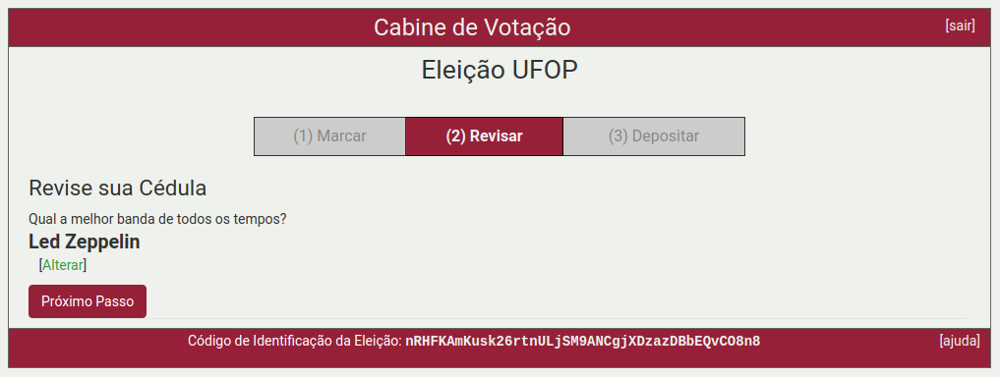
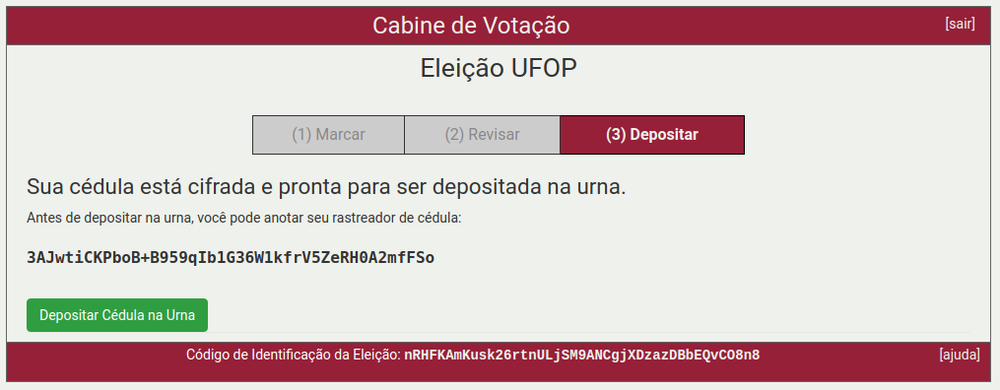
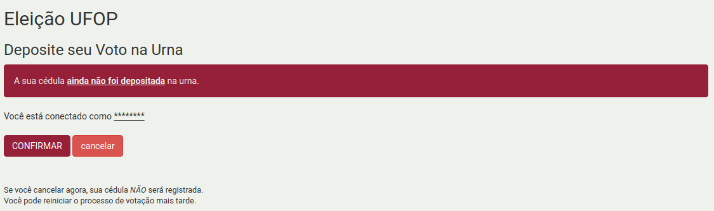

# Como votar usando o sistema de votação eletrônica

1. A página inicial contém as instruções, clique no botão **Iniciar**
    

2. Escolha somente um dos candidatos e se a eleição possuir mais de uma questão, então clique no botão **Próximo passo**.

    

3. Nesta etapa é possível revisar as escolhas de voto e caso esteja tudo correto clique no botão **Próximo passo**.

    -   Se desejar alterar o voto, basta clicar no link **alterar** e a tela retornará para a cédula de votação com todos os candidatos disponíveis para nova escolha.

    

4. Sua cédula foi criptografada, e se preferir, anote o código rastreador da sua cédula. Vale lembrar que o sistema de votação enviará esse código para o seu e-mail. Clique no botão **Depositar Cédula na Urna** para prosseguir.

    

5. Clique no botão **Conecte-se com a sua conta MinhaUfop** para autenticar-se no sistema.
    

6. Para autenticar-se no sistema, utilize o seu CPF \(sem pontos e hífen\) e a senha do Portal MinhaUfop.

    

7. Clique no botão **Confirmar** para depositar sua cédula na urna. Se não deseja depositar a cédula, clique no botão cancelar.
    

8. Parabéns, seu voto foi depositado com sucesso.
    

**Atenção:** O sistema Helios permite que você deposite cédulas na urna quantas vezes desejar. Porém, somente a última cédula depositada é a que será contabilizada na apuração da urna. Todas as cédulas anteriores serão descartadas.  